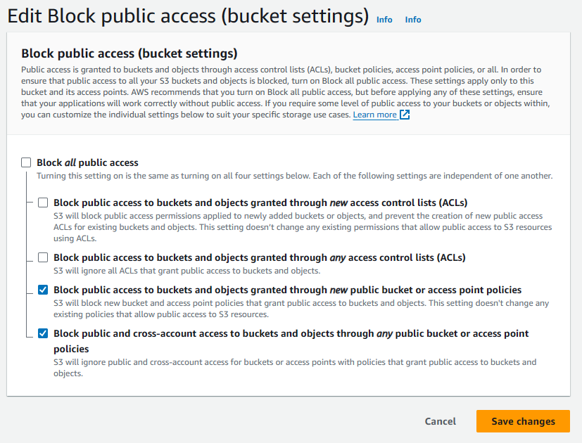

# Introduction

MediaLit is a Node.js based app to store, convert and optimise the media files on any AWS S3 compatible storage.

## Setting up correct access on AWS S3 bucket

Before you start uploading to your bucket, make sure you have set up the correct access on your S3 bucket.

### 1. Without Cloudfront



### 2. With Cloudfront


## Using Cloudfront

If you need to use a Cloudfront CDN, you can enable it in the app, by setting up the following values in your .env file.

```sh
USE_CLOUDFRONT=true
CLOUDFRONT_ENDPOINT=CLOUDFRONT_DISTRIBUTION_NAME
CLOUDFRONT_PRIVATE_KEY="PRIVATE_KEY"
CLOUDFRONT_KEY_PAIR_ID=KEY_PAIR_ID
```

We assume that since you are using Cloudfront, you have locked down your bucket from public access. Therefore, all the files uploaded to the bucket will have ACL set to `private` i.e. they will require signed URLs in order to access them.

### Generating a key pair

Use the following commands to generate a key pair to be used above.

```sh
openssl genrsa -out private_key.pem 2048
openssl rsa -pubout -in private_key.pem -out public_key.pem
```

## Enable trust proxy

This app is based on [Express](https://expressjs.com/) which cannot work reliably when it is behind a proxy. For example, it cannot detect if it behind a proxy.

Hence, we need to enable it on our own. To do that, set the following environment variable.

```
ENABLE_TRUST_PROXY=true
```

## Creating a local user

In order to interact with the API, you need to have an API key. To create one, execute the following command.

```sh
docker exec <container_id | container_name> node /app/apps/api/dist/src/scripts/create-local-user.js <email>
```

After running the above command, you will get an API key which you can use to interact with the app.

You can only run this script once.

> CAUTION: Keep the generated API key confidential as anyone could be able to store files on your instance.

## Development

We build on Linux based systems. Hence the instructions are for those system only. If you are on Windows, we recommend using WSL.

### Install the utilities

```bash
sudo apt install ffmpeg webp
```

### Install dependencies

```bash
pnpm install
```

### Build packages

```bash
pnpm --filter=@medialit/images build
pnpm --filter=@medialit/thumbnail build
```

### Run the service

```bash
pnpm --filter=@medialit/api dev
```

### Publishing a new version

```bash
pnpm exec changeset
```
